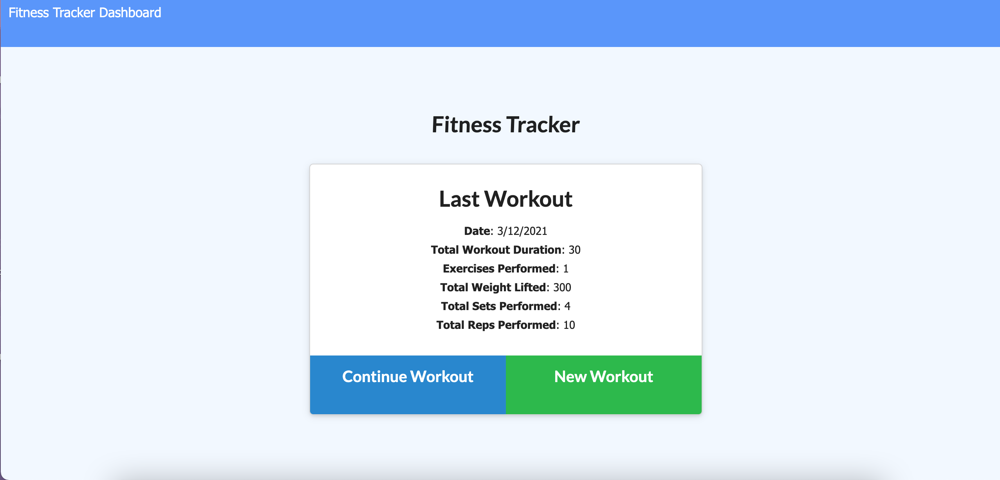
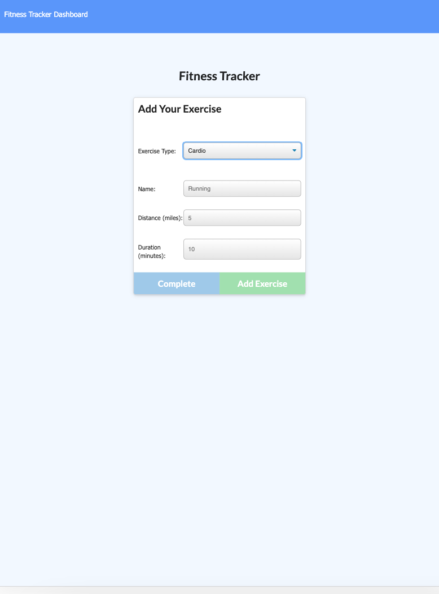
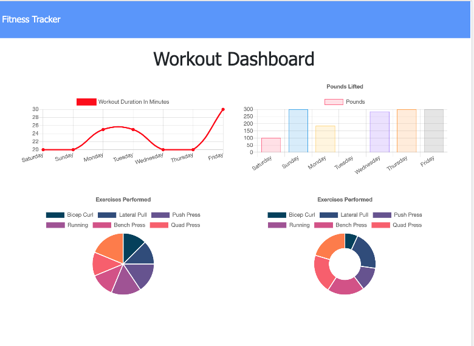

# Fitness Tracker

### Version 1.0

 

## License:
 

 

## Description

This application uses a full CRUD environment using mongoDB and moongoose to create a simple fitness tracker application. The user is able to view their last workout and see the date, total duration of the workout and more on the home page. Additionally they can add new workouts, either cardio or resistance workout; or they could add to the current workout being shown.  If added to the current workout, the data will be updated to show the new totals. 

The user can also view a dashboard with charts to review total workout duration and pounds lifted in the last 7 days. 

 

## Installation and Instructions

        1. Load Packages:

            npm init

        2. Run Application:

            node server.js
 

## Requirements

        1. Install Dependencies:

            npm install express
            npm install mongoose
            npm install morgan

        2. Database:

            Install latest version of Mongo and Robo 3T.

 

## Link to application:

https://fitnesstracker21.herokuapp.com

 

## Link to repository:

https://github.com/rwanke14/fitnesstracker

 

## Screenshots of Application:

 

 

 

 

## Additional sources:

Also worked with my study group to better understand how to apply what we learned in class to this readme. Note: Some code may look similar since we generally come out these thinking in the same ways. 

Feedback, brainstorming, and general support to study group:

        1. Young Ji Kim - https://github.com/youjmi
        2. Amir Ashtiany - https://github.com/Alexfit4
        3. Johnnie Simpson - https://github.com/balokdecoy
        5. Frankie Rosado - https://github.com/Franciscorosado09
